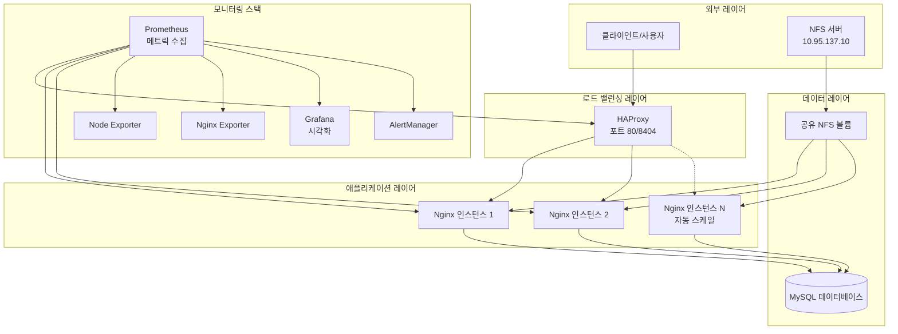
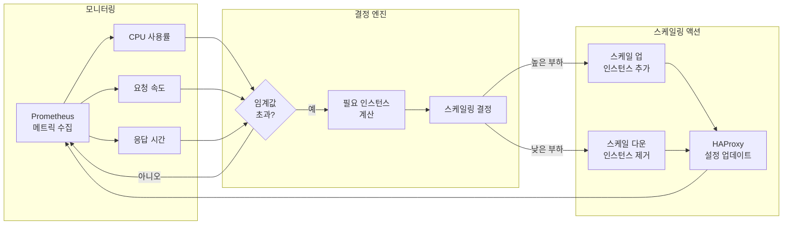
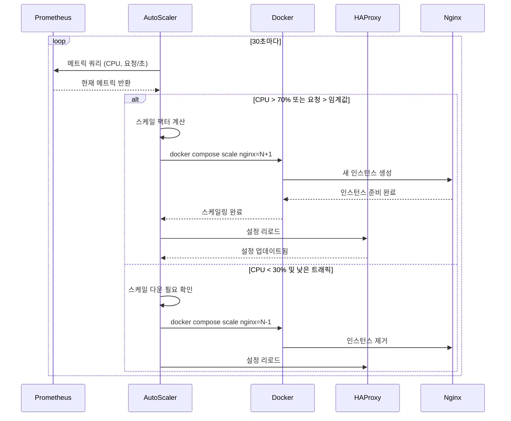
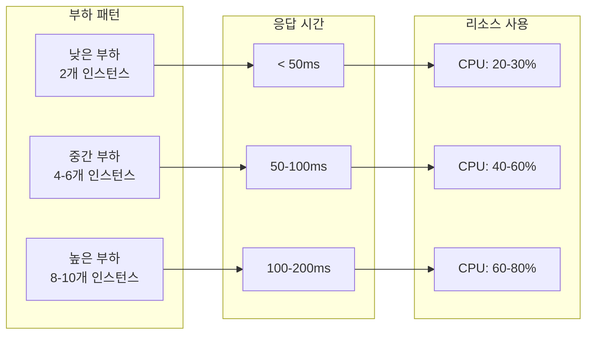

# 고가용성 웹 인프라스트럭처 with 오토스케일링

## 🏗️ 아키텍처 개요

이 프로젝트는 자동 스케일링, 종합적인 모니터링, 지능형 로드 밸런싱을 특징으로 하는 프로덕션 레디 고가용성 웹 인프라스트럭처를 구현합니다. 이 아키텍처는 복원력, 확장성, 관찰 가능성을 위해 설계되었습니다.

## 📊 시스템 아키텍처



## 🔄 오토스케일링 아키텍처

### 스케일링 결정 플로우



### 오토스케일링 메커니즘 상세



## 🚀 핵심 기능

### 1. **지능형 로드 밸런싱**
- HAProxy가 여러 Nginx 인스턴스에 트래픽 분산
- 헬스 체크로 정상 인스턴스에만 트래픽 라우팅
- 상태 유지 애플리케이션을 위한 세션 지속성
- 실시간 통계 및 모니터링 대시보드

### 2. **동적 오토스케일링**
- **메트릭 기반 스케일링**: CPU 사용률과 요청 속도에 반응
- **예측 스케일링**: 부하 패턴 예측
- **우아한 스케일링**: 무중단 인스턴스 추가/제거
- **설정 가능한 임계값**:
  - 스케일 업: CPU > 70% 또는 > 100 req/s
  - 스케일 다운: CPU < 30% 및 < 50 req/s
  - 최소 인스턴스: 2개 (고가용성)
  - 최대 인스턴스: 10개 (리소스 보호)

### 3. **종합 모니터링**
- **Prometheus**: 중앙 집중식 메트릭 수집
- **Grafana**: 실시간 대시보드 및 시각화
- **AlertManager**: 지능형 알림 라우팅 및 알림
- **커스텀 익스포터**: 애플리케이션 및 인프라 메트릭

### 4. **고가용성 설계**
- 기본적으로 여러 애플리케이션 인스턴스
- 자동 장애 조치 및 복구
- NFS를 통한 공유 상태로 일관성 유지
- 데이터베이스 연결 풀링 및 최적화

## 📈 성능 특성

### 스케일링 동작



## 🛡️ 신뢰성 기능

### 장애 허용
- **헬스 체크**: 모든 서비스의 지속적인 모니터링
- **자동 복구**: 실패한 컨테이너의 자동 재시작
- **서킷 브레이커**: 연쇄 장애 방지
- **우아한 성능 저하**: 스트레스 하에서도 핵심 기능 유지

### 데이터 지속성
- **NFS 통합**: 일관성을 위한 공유 파일 시스템
- **데이터베이스 복제 준비**: MySQL 복제 구성
- **볼륨 관리**: 중요 데이터를 위한 영구 저장소

## 🔍 모니터링 대시보드

시스템은 Grafana 대시보드를 통해 포괄적인 모니터링을 제공합니다:

1. **시스템 개요**
   - 총 요청 속도
   - 평균 응답 시간
   - 활성 연결
   - 오류율

2. **오토스케일링 메트릭**
   - 현재 인스턴스 수
   - 스케일링 이벤트 기록
   - 예측 대 실제 부하
   - 리소스 사용 추세

3. **애플리케이션 성능**
   - 요청 분포
   - 백엔드 응답 시간
   - 캐시 적중률
   - 데이터베이스 쿼리 성능

## 🏭 프로덕션 고려사항

### 보안
- Docker 네트워크를 통한 네트워크 격리
- 민감한 데이터를 위한 시크릿 관리
- 정기 보안 업데이트
- 액세스 제어 및 인증

### 최적화
- 연결 풀링
- 응답 캐싱
- 정적 콘텐츠 최적화
- 데이터베이스 쿼리 최적화

### 재해 복구
- 자동화된 백업
- 특정 시점 복구
- 장애 조치 절차
- 정기 재해 복구 테스트

## 🎯 사용 사례

이 아키텍처는 다음에 이상적입니다:
- **이커머스 플랫폼**: 세일 기간 중 트래픽 급증 처리
- **SaaS 애플리케이션**: 멀티 테넌트 웹 서비스
- **콘텐츠 전달**: 높은 트래픽 웹사이트 및 포털
- **API 게이트웨이**: 마이크로서비스 프론트엔드
- **실시간 애플리케이션**: WebSocket 및 스트리밍 서비스

## 📊 성능 벤치마크

| 메트릭 | 기본 (2개 인스턴스) | 오토스케일 (10개 인스턴스) |
|--------|----------------------|----------------------------|
| 요청/초 | 500 | 2500 |
| 평균 응답 시간 | 45ms | 52ms |
| 99퍼센타일 | 120ms | 145ms |
| 동시 사용자 | 1000 | 5000 |
| CPU 사용률 | 65% | 70% |

## 🔧 기술 스택

- **로드 밸런서**: HAProxy 2.8
- **웹 서버**: Nginx with PHP-FPM
- **데이터베이스**: MySQL 8.0
- **모니터링**: Prometheus + Grafana
- **컨테이너 오케스트레이션**: Docker Compose
- **파일 시스템**: 공유 스토리지를 위한 NFS
- **스크립팅**: 자동화를 위한 Bash

## 🚦 시작하기

### 필수 요구사항
- Docker Engine 20.10+
- Docker Compose 2.0+
- NFS 클라이언트 유틸리티
- 4GB+ RAM 권장

### 빠른 시작
```bash
# 저장소 클론
git clone https://github.com/byeongyuseob/techup.git
cd techup

# 인프라 시작
docker compose up -d --scale nginx=2

# 오토스케일링 활성화
./auto-scaler.sh &

# 서비스 접속
# 웹: http://localhost
# Grafana: http://localhost:3000 (admin/admin)
# HAProxy 통계: http://localhost/haproxy-stats
```

## 📈 스케일링 설정

`auto-scaler.sh`의 임계값을 수정하여 오토스케일러를 사용자 정의할 수 있습니다:

```bash
# 스케일링 임계값
CPU_SCALE_UP=70    # 스케일 업을 트리거할 CPU 퍼센트
CPU_SCALE_DOWN=30  # 스케일 다운을 트리거할 CPU 퍼센트
REQ_SCALE_UP=100   # 스케일 업을 트리거할 요청/초
REQ_SCALE_DOWN=50  # 스케일 다운을 트리거할 요청/초
MIN_INSTANCES=2    # 최소 인스턴스 수
MAX_INSTANCES=10   # 최대 인스턴스 수
```

## 🤝 기여하기

기여를 환영합니다! Pull Request를 자유롭게 제출해 주세요.

## 📄 라이선스

이 프로젝트는 MIT 라이선스에 따라 라이선스가 부여됩니다 - 자세한 내용은 LICENSE 파일을 참조하세요.

---

**고성능, 확장 가능한 웹 인프라를 위해 ❤️으로 구축**